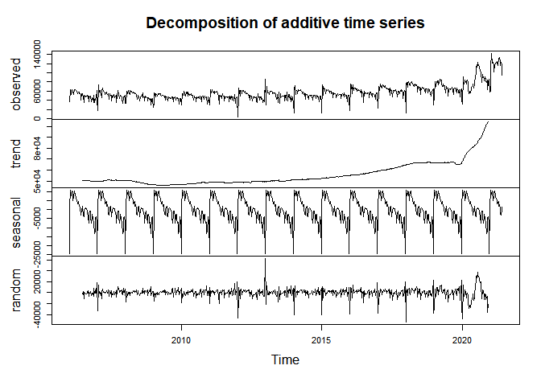
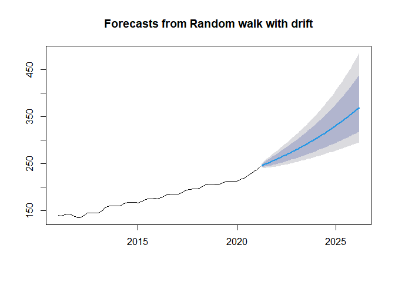

# Szereg - Rozwój biznesu

Na szereg ten składają się dane po chodzące ze strony
[FRED](https://fred.stlouisfed.org/series/BUSAPPWNSAUS "FRED Economic data - Business Applications for United States").Dane
zbierane są przez U.S Census Bureau, obejmują lata 2006-2021. Zbierane
są w tygodniowych odstępach i dotyczą ilości wniosków o wydanie
identyfikatora EAN (Employer Identyfication Number). Każdy pracodawna,
koropracja, organizacja non-profit itp muszą posiadać takie numery, aby
móc rozliczać się z podatku. Jest to zatem dobry wskaźnik tego ile
nowych biznesów powstaje.

Do korzyści jakie przyniesie prognoza należy przewidywanie rozwoju
gospodarki, gdyż nowo powstające biznesy mogą świadczyć o tym że w kraju
panują korzystne warunki do rozwoju biznesu. Analiza szeregu pozwoli też
przewidzieć jak ludzie postrzegają obecny stan gospodarki - czy są w
stanie zaryzykować inwestując we własny biznes.

## Wczytanie danych

W tym etapie wczytałem dane oraz uzupełniłem brakujące wartości
średnimi.

    ## Warning: NAs introduced by coercion

    ##         DATE BUSAPPWNSAUS
    ## 1 2006-01-07        39580
    ## 2 2006-01-14        36920
    ## 3 2006-01-21        63300
    ## 4 2006-01-28        51910
    ## 5 2006-02-04        61430
    ## 6 2006-02-11        62890

## Główne cechy analizowanych danych

Tak prezentuje się wykres ilości wniosków w czasie:

``` r
library("forecast")
```

    ## Registered S3 method overwritten by 'quantmod':
    ##   method            from
    ##   as.zoo.data.frame zoo

``` r
t <- ts(d$BUSAPPWNSAUS, freq = 365.25/7, start =  2006 + 7/365.25)
plot(t)
```


Z wykresu wywnioskować możemy że szereg ten posiada dużą sezonowość,
pojawia się tu charakterystyczny wzorzec (odstające szpilki). Widać
także niewielki dodatni trend, który gwałtownie rośnie na początku roku
2020.

``` r
seasonplot(t)
```


Porównując kolejne roczne sezony między sobą, sezonowość widać jeszcze
dokładniej. Pojawia się też rok 2020, który znacznie odstaje
wartościami, lecz kształtem nadal przypomina poprzednie sezony.

``` r
Acf(t)
```


Powolny spadek dodatnich wartości funkcji Acf wskazuje dodatni trend w
szeregu.

``` r
Pacf(t, lag.max = 60)
```


Na wykresie pojawia się wartość znacząca przy Lag=52, ponieważ dane są
tygodniowe oznacza to korelację z danymi z poprzednich lat.

## Dekompozycja szeregu

### Modele regresji z trendem liniowym i sezonowością

Poniższy wykres przedstawia dopasowanie dwóch modeli liniowych trendu, z
czego jeden z nich uwzględnia sezonowość.

``` r
ti <- t
tT <- tslm(t ~ trend) # Model regrasji z trendem liniowym
tTS <- tslm(t ~  trend + season) # Model regresji z trendem liniowym i sezonowością
plot(t)
lines(fitted(tT), col = "blue", lty = 2)
lines(fitted(tTS), col = "red", lty = 2)
```


Model czerwony, uwzględniający sezonowość, został bardzo dobrze
dopasowany do szeregu. Wręcz za dobrze (gdyż mogło dojść do
przeuczenia), gdyż wektor reszt jest wektorem samych zer.

``` r
head(tTS$residuals)
```

    ## Time Series:
    ## Start = 2006.01916495551 
    ## End = 2006.11498973306 
    ## Frequency = 52.1785714285714 
    ## [1] 0 0 0 0 0 0

Poniżej model uwzględniający wyłącznie trend liniowy. Sezonowość nadal
występuje. Widać też niewielki trend po roku 2020.

``` r
tsdisplay(tT$residuals)
```


### Model addytywny

Ze względu na to , że wariancja sezonowa nie zmienia się w czasie (z
wyjątkiem lat 2020 i w wzwyż), zastosowałem dekompozycję addytywną.

``` r
t.decompose.add <- decompose(t)
plot(t.decompose.add)
```



Szereg został rozłożony na swoje składowe, wyraźnie widać sezonowość.
Trend najbardziej widoczny jest po roku 2015.

``` r
tsdisplay(t.decompose.add$random)
```


Z wykresów funkcji ACF i PACF odczytać możemy, że cała sezonowość nie
została usunięta z szeregu(PACF posiada wartość odstającą \~52).

## Eliminacja trendu i sezonowości

Z poprzednich wykresów wiem, że szereg charakteryzuje się wyraźnym
trendem i sezonowością, którą należy wyeliminować. Dodatkowo, aby pozbyć
się gwałtownej zmiany wariancji z początku roku 2020, zastosuję
transformację logarytmiczną Boxa-Coxa.

``` r
t.bc <- BoxCox(t, lambda = 0)
t.bc.52 <- diff(t.bc, lag = 52)
tsdisplay(t.bc.52)
```


Po usunięciu sezonowości i zastosowaniu transformacji Boxa-Coxa, nadal
pozostał silny trend - wykres funkcji ACF jest dodatni i stopniowo
maleje.

``` r
t.bc.52.1 <- diff(t.bc.52, lag = 1)
tsdisplay(t.bc.52.1)
```


Szereg ten nie jest realizacją szumu białego. Widać to po znaczących
wartościach odstających dla lag=52. Stacjonarność szeregu sprawdzę
korzystając z biblioteki urca, dla ufności *α* = 0.05. Zawiera ona test
na stacjonarność szeregu: *H*<sub>0</sub> - szereg jest
stacjonarny,wobec hipotezy alternatywnej: szereg nie jest stacjonarny.

``` r
library(urca)
t.bc.52.1 %>% ur.kpss() %>% summary()
```

    ## 
    ## ####################### 
    ## # KPSS Unit Root Test # 
    ## ####################### 
    ## 
    ## Test is of type: mu with 6 lags. 
    ## 
    ## Value of test-statistic is: 0.0072 
    ## 
    ## Critical value for a significance level of: 
    ##                 10pct  5pct 2.5pct  1pct
    ## critical values 0.347 0.463  0.574 0.739

Wartość statystyki jest bardzo mała, wynosi 0.0072, co jest poniżej
wartości krytycznej dla zadanego poziomu ufności. Zatem brak podstaw do
odrzucenia hipotezy o stacjonarności szeregu.

## Wyznaczenie rzędu MA

Do wyznaczenia parametrów skorzystam z funkcji Acf. Rząd modelu dobiorę
na podstawie wartości odstających.

``` r
Acf(t.bc.52.1, lag.max = 210)
```


Do wyboru mam rzędy MA równe:

``` r
t.bc.52.1.acf <- Acf(t.bc.52.1, plot = FALSE, lag.max = 210)
t.bc.52.1.acf$lag[which(abs(t.bc.52.1.acf$acf)>1.96/sqrt(t.bc.52.1.acf$n.used))] # Wszystkie lag poza przedziałem
```

    ##  [1]   0   1  25  26  35  37  50  52  53  57  77  78  79  98 103 106 120 135 182
    ## [20] 183 207 208

Obliczam współczynniki MA(52) i MA(26):

``` r
st <- t.bc.52.1 # szereg stacjonarny
st.ma52 <- Arima(st, order = c(0,0,52))
st.ma26 <- Arima(st, order = c(0,0,26))
```

Oto część obliczonych współczynników dla modeli:

``` r
c(st.ma26$aic, st.ma26$aicc, st.ma26$bic)
```

    ## [1] -379.6606 -377.4144 -250.2239

``` r
st.ma26$coef[1:5]
```

    ##          ma1          ma2          ma3          ma4          ma5 
    ## -0.859902576 -0.049606422  0.075821570  0.005219935 -0.050431425

``` r
c(st.ma52$aic, st.ma52$aicc, st.ma52$bic)
```

    ## [1] -475.6156 -467.0934 -225.9879

``` r
st.ma52$coef[1:5]
```

    ##         ma1         ma2         ma3         ma4         ma5 
    ## -1.06816716  0.17039435  0.24707782 -0.08641077 -0.11456170

## Wyznaczenie rzędu AR

Do wyznaczenia parametrów skorzystam z funkcji Pacf. Rząd modelu dobiorę
na podstawie wartości odstających.

``` r
Pacf(t.bc.52.1, lag.max = 210)
```


Do wyboru mam rzędy AR równe:

``` r
t.bc.52.1.pacf <- Pacf(t.bc.52.1, plot = FALSE, lag.max = 210)
t.bc.52.1.pacf$lag[which(abs(t.bc.52.1.pacf$acf)>1.96/sqrt(t.bc.52.1.pacf$n.used))] # Wszystkie lag spoza przedziałem
```

    ##  [1]   1   2   3   4   5   6   7  10  21  24  34  50  51  52  53  54  56  77 103
    ## [20] 106 129 181 206 207

Obliczam współczynniki AR(52), AR(56):

``` r
st.ar56.yw <-ar(st, order.max = 56, aic = FALSE, method = "yule-walker")
st.ar56.burg <- ar(st, order.max = 56, aic = FALSE, method ="burg")
st.ar52.yw <- ar(st, order.max = 52, aic = FALSE)
st.ar1.yw<- ar(st, order.max = 1, aic = FALSE)
```

``` r
st.ar56 <- Arima(st, order = c(56,0,0))
st.ar52 <- Arima(st, order = c(52,0,0), method = "CSS")
```

Współczynniki, aic, aicc oraz bic:

``` r
c(st.ar56$aic, st.ar56$aicc, st.ar56$bic)
```

    ## [1] -540.7466 -530.8707 -272.6279

``` r
st.ar56$coef[1:10]
```

    ##        ar1        ar2        ar3        ar4        ar5        ar6        ar7 
    ## -0.9487120 -0.8260767 -0.6259190 -0.4940899 -0.3920653 -0.3648660 -0.3333275 
    ##        ar8        ar9       ar10 
    ## -0.2994878 -0.2852825 -0.2868088

``` r
c(st.ar52$aic, st.ar52$aicc, st.ar52$bic)
```

    ## [1] NA NA NA

``` r
st.ar52$coef[1:10]
```

    ##        ar1        ar2        ar3        ar4        ar5        ar6        ar7 
    ## -0.9007710 -0.8146844 -0.6827974 -0.5901726 -0.5369683 -0.5193530 -0.4808162 
    ##        ar8        ar9       ar10 
    ## -0.4372768 -0.4041186 -0.3910632

Współczynniki dla AR(56) i AR(52) są podobne.

## auto.arima

``` r
au <- auto.arima(st)
```

``` r
summary(au)
```

    ## Series: st 
    ## ARIMA(1,0,0)(1,0,0)[52] with zero mean 
    ## 
    ## Coefficients:
    ##           ar1     sar1
    ##       -0.5210  -0.4427
    ## s.e.   0.0314   0.0322
    ## 
    ## sigma^2 estimated as 0.03631:  log likelihood=174.79
    ## AIC=-343.58   AICc=-343.54   BIC=-329.71
    ## 
    ## Training set error measures:
    ##                       ME      RMSE        MAE      MPE     MAPE      MASE
    ## Training set 0.001074207 0.1903062 0.09991121 263.6516 471.3774 0.4860781
    ##                    ACF1
    ## Training set -0.2010561

## Porównanie analizowanych modeli

Wszystkie modele korzystały z transformacji Boxa-Coxa więc mogę je
porównywać między sobą.

    # ARIMA(0,0,26)             AIC=-379.66   AICc=-377.41   BIC=-250.22
    # ARIMA(0,0,52)             AIC=-475.62   AICc=-467.09   BIC=-225.99
    # ARIMA(56,0,0)             AIC=-540.75 + AICc=-530.87 + BIC=-272.63
    # ARIMA(1,0,0)              AIC=-181.41   AICc=-181.38   BIC=-167.54
    # ARIMA(1,0,0)(1,0,0)[52]   AIC=-343.58   AICc=-343.54   BIC=-329.71  +

Ze wszystkich modeli, najlepszym wydaje się ARIMA(56,0,0). Pomimo dużej
ilości, parametrów jako jedyny przechodzi test Ljung-Boxa (dla
*α* = 0.05). Analiza reszt znajduje się na wykresach poniżej.

``` r
checkresiduals(st.ar56)
```


    ## 
    ##  Ljung-Box test
    ## 
    ## data:  Residuals from ARIMA(56,0,0) with non-zero mean
    ## Q* = 70.555, df = 47.357, p-value = 0.01601
    ## 
    ## Model df: 57.   Total lags used: 104.357142857143

## Prognozowanie

### Prognozowanie naiwne metodą średniej

``` r
t.meanf <- meanf(t, h = 60)
plot(t.meanf)
```


Prognozowanie naiwne metodą średniej nie daje dobrych rezultatów, może
być to spowodowane tym iż szereg ten zawiera trend i sezonowość.
Prognoza dla szeregu bez trendu i sezonowości:

``` r
st.meanf <- meanf(st, h = 60)
plot(st.meanf)
```


Prognoza ta jest dużo lepsza. Dodając trend i sezonowość moglibyśmy
uzyskać nią lepsze przewidywania, niż za pierwszym razem.

### Prognozowanie naiwne sezonowe

``` r
t.snaive <- snaive(t, h = 60)
```

    ## Warning in lag.default(y, -lag): 'k' is not an integer

``` r
plot(t.snaive)
```


Prognoza naiwna sezonowa daje na pierwszy rzut oka najlepsze rezultaty.
Uwzględnia ona silną sezonowość szeregu oraz to że w poprzednich latach
składowa trendu była dużo większa, jednak nie uwzględnia ona przyszłego
wzrostu trendu.

# Index cen nieruchomości

Szereg ten pochodzi ze strony
[FRED](https://fred.stlouisfed.org/series/CSUSHPINSA). Szereg obliczany
jest na podstawie danych z obrotów nieruchomościami i wygładzany jest z
pomocą 3-miesięcznej średniej ruchomej. Głównie brane pod uwagę są domy
jednorodzinne. Szereg rozstał unormowany tak aby cena ze stycznia 2000
roku była równa 100 i każda następna jest określona wobec niej.

Korzyści jakie może przynieść analiza tego szeregu to przewidywanie cen
nieruchomości na rynku czy przewidywanie kolejnej bańki finansowej.

## Wczytanie danych

Dane pobrane zostały ze strony
<https://fred.stlouisfed.org/series/CSUSHPINSA> w formacie csv.

``` r
ind <- read.csv2("Datasets/CSUSHPINSA.csv", sep = ",")
ind$CSUSHPINSA <- as.numeric(ind$CSUSHPINSA)
head(ind)
```

    ##         DATE CSUSHPINSA
    ## 1 1987-01-01     63.735
    ## 2 1987-02-01     64.135
    ## 3 1987-03-01     64.471
    ## 4 1987-04-01     64.977
    ## 5 1987-05-01     65.552
    ## 6 1987-06-01     66.221

## Główne cechy analizowanych danych

Zacznę od zamiany szeregu na szereg czasowy oraz analizy funkcji ACF i
PACF.

``` r
ind.ts <- ts(ind$CSUSHPINSA, start = c(1987, 01), frequency = 12)
tsdisplay(ind.ts)
```


Szereg charakteryzuje się dodatnim trendem (dodatnia, powoli opadająca
funkcja ACF). Na pierwszy rzut oka nie widać sezonowości, także funkcja
PACF na nią nie wskazuje.

## Dekompozycje szeregu

### Modele z trendem liniowym, wielomianowym i sezonowością

``` r
ti <- ind.ts
tT <- tslm(ti ~ trend) # Model regrasji z trendem liniowym
tTS <- tslm(ti ~  trend + season) # Model regresji z trendem liniowym i sezonowością
tPS <- tslm(ti ~  poly(trend, raw=TRUE, degree = 9)) # Model regresji z trendem liniowym i
plot(ti)
lines(fitted(tT), col = "blue", lty = 2)
lines(fitted(tTS), col = "red", lty = 2)
lines(fitted(tPS), col = "green", lty = 2)
```


Dekompozycja wskazuje na to, że nie jest to trend liniowy. Sezonowość
również nie jest wyraźnie widoczna i nie wpływa na dopasowanie modelu do
szeregu.

### Model multiplikatywny

``` r
ind.decompose <- decompose(ind.ts, type ="multiplicative")
plot(ind.decompose)
```


Dekompozycja multiplikacyjna potwierdza wcześniejsze wyniki. Wyraźny
jest trend, patrząc na rząd uzyskanej sezonowości, jest on dwukrotnie
mniejszy od trendu.

## Usunięcie trendu i sezonowości

Tym razem skorzystam z pomocy funkcji `ndiffs` i `nsdiffs`, wskazują one
ile razy należy różnicować, aby usunąć trend i sezonowość.

``` r
ndiffs(ind.ts)
```

    ## [1] 2

``` r
nsdiffs(ind.ts)
```

    ## [1] 1

Funkcje wskazują na to, że aby uzyskać szereg stacjonarny należy
zróżnicować dwukrotnie z lag=1 oraz jednokrotnie z lag=12.

``` r
ind.lambda <- BoxCox.lambda(ind.ts)
ind.bc <- BoxCox(ind.ts, ind.lambda)
ind.bc.1.1 <- diff(diff(ind.bc, lag = 1), lag = 1)
ind.bc.1.1.12 <- diff(ind.bc.1.1, lag = 12)
tsdisplay(ind.bc.1.1.12, lag.max = 100)
```


Jak widać po zróżnicowaniu reszty przypominają już szereg stacjonarny.
Zostanie to jeszcze potwierdzone testem.

``` r
shapiro.test(ind.bc.1.1.12)
```

    ## 
    ##  Shapiro-Wilk normality test
    ## 
    ## data:  ind.bc.1.1.12
    ## W = 0.928, p-value = 6.778e-13

Szereg reszt nie jest realizacją szumu białego.

``` r
ind.bc.1.1.12 %>% ur.kpss(use.lag = 12) %>% summary()
```

    ## 
    ## ####################### 
    ## # KPSS Unit Root Test # 
    ## ####################### 
    ## 
    ## Test is of type: mu with 12 lags. 
    ## 
    ## Value of test-statistic is: 0.0219 
    ## 
    ## Critical value for a significance level of: 
    ##                 10pct  5pct 2.5pct  1pct
    ## critical values 0.347 0.463  0.574 0.739

Test wskazuje na to, że nie ma podstaw do odrzucenia hipotezy o tym, że
szereg jest stacjonarny.

## Wyznaczenie rzędu MA

``` r
ind.st <- ind.bc.1.1.12 # Szereg stacjonarny
Acf(ind.st, lag.max = 50)
```


Do rozważenia mamy następujące modele MA:

``` r
ind.st.acf <- Acf(ind.st, plot = FALSE, lag.max = 100)
ind.st.acf$lag[which(abs(ind.st.acf$acf)>1.96/sqrt(ind.st.acf$n.used))] # Wszystkie lag poza przedziałem
```

    ## [1]  0  3  5  9 12 17 47

Wyznaczę modele MA(12), MA(9) oraz MA(3):

``` r
ind.st.ma12 <- Arima(st, order = c(0,0,12))
ind.st.ma9 <- Arima(st, order = c(0,0,9))
ind.st.ma3 <- Arima(st, order = c(0,0,3))
```

Część współczynników oraz metryki modeli:

``` r
c(ind.st.ma12$aic, ind.st.ma12$aicc, ind.st.ma12$bic)
```

    ## [1] -390.4213 -389.8514 -325.7030

``` r
ind.st.ma12$coef[1:5]
```

    ##          ma1          ma2          ma3          ma4          ma5 
    ## -0.858869447 -0.043293060  0.083407918 -0.007491112 -0.049770078

``` r
c(ind.st.ma9$aic, ind.st.ma9$aicc, ind.st.ma9$bic)
```

    ## [1] -396.3046 -395.9478 -345.4545

``` r
ind.st.ma9$coef[1:5]
```

    ##          ma1          ma2          ma3          ma4          ma5 
    ## -0.858550110 -0.043606374  0.083994651 -0.008120658 -0.050630764

``` r
c(ind.st.ma3$aic, ind.st.ma3$aicc, ind.st.ma3$bic)
```

    ## [1] -397.3129 -397.2324 -374.1992

``` r
ind.st.ma3$coef
```

    ##           ma1           ma2           ma3     intercept 
    ## -0.8500634318 -0.0501600018  0.0141696263  0.0008092502

Współczynniki MA(12) i MA(9) są podobne. Wszystkie modele mają podobne
wartości AIC, AICc oraz BIC.

## Wyznaczenie rzędu AR

Rzędy modelu AR można odczytać z wykresu Pacf.

``` r
Pacf(ind.st, lag.max = 50)
```


Skorzystam z pomocniczej funkcji.

``` r
ind.st.pacf <- Pacf(ind.st, plot =  FALSE, lag.max = 100)
ind.st.pacf$lag[which(abs(ind.st.pacf$acf)>1.96/sqrt(ind.st.pacf$n.used))] # Wszystkie lag poza przedziałem
```

    ## [1]  3  5  9 12 15 24 35 60 82

Obliczę współczynniki dla AR(3), AR(15), AR(9) i AR(5).

``` r
ind.st.ar3 <- Arima(st, order = c(3,0,0))
ind.st.ar15 <- Arima(st, order = c(15,0,0))
ind.st.ar9 <- Arima(st, order = c(9,0,0))
ind.st.ar5 <- Arima(st, order = c(5,0,0))
```

Część współczynników oraz metryki modeli:

``` r
c(ind.st.ar3$aic, ind.st.ar3$aicc, ind.st.ar3$bic)
```

    ## [1] -338.0322 -337.9517 -314.9185

``` r
ind.st.ar3$coef[1:3]
```

    ##        ar1        ar2        ar3 
    ## -0.7416738 -0.5372127 -0.2538657

``` r
c(ind.st.ar15$aic, ind.st.ar15$aicc, ind.st.ar15$bic)
```

    ## [1] -375.9754 -375.1416 -297.3889

``` r
ind.st.ar15$coef[1:5]
```

    ##        ar1        ar2        ar3        ar4        ar5 
    ## -0.8430700 -0.7493221 -0.5799817 -0.4492130 -0.3843793

``` r
c(ind.st.ar9$aic, ind.st.ar9$aicc, ind.st.ar9$bic)
```

    ## [1] -373.2033 -372.8466 -322.3532

``` r
ind.st.ar9$coef[1:5]
```

    ##        ar1        ar2        ar3        ar4        ar5 
    ## -0.8256883 -0.7168246 -0.5305624 -0.3837239 -0.3076455

``` r
c(ind.st.ar5$aic, ind.st.ar5$aicc, ind.st.ar5$bic)
```

    ## [1] -356.1699 -356.0194 -323.8107

``` r
ind.st.ar5$coef[1:5]
```

    ##         ar1         ar2         ar3         ar4         ar5 
    ## -0.79174118 -0.64811758 -0.41641226 -0.21625553 -0.08736639

Współczynniki wszystkich modeli oraz ich metryki są podobne.

## auto.arima

``` r
ind.auto <- auto.arima(ind.st, max.p = 20, max.q = 20, max.P = 5, max.Q = 5, ic="aicc")
summary(ind.auto)
```

    ## Series: ind.st 
    ## ARIMA(1,0,3)(0,0,2)[12] with zero mean 
    ## 
    ## Coefficients:
    ##          ar1      ma1      ma2      ma3     sma1     sma2
    ##       0.5454  -0.3791  -0.0528  -0.3352  -0.6643  -0.1926
    ## s.e.  0.0950   0.0990   0.0499   0.0507   0.0523   0.0497
    ## 
    ## sigma^2 estimated as 1.403e-09:  log likelihood=3478.41
    ## AIC=-6942.82   AICc=-6942.53   BIC=-6914.93
    ## 
    ## Training set error measures:
    ##                        ME         RMSE          MAE      MPE     MAPE      MASE
    ## Training set 1.983769e-06 3.717278e-05 2.487803e-05 251.2911 304.1389 0.4875051
    ##                     ACF1
    ## Training set -0.01005086

## Porównanie analizowanych modeli

Zebrałem parametry AIC, AICc oraz BIC dla tego szeregu w tabeli poniżej.
Wybrany zostanie model, który ma te współczynniki najmniejsze.

    # ARIMA(0 ,0,12)                AIC=-390.4213   AICc=-389.8514   BIC=-325.7030} 
    # ARIMA(0 ,0, 9)            AIC=-396.3046   AICc=-395.9478   BIC=-345.4545 
    # ARIMA(0 ,0, 3)            AIC=-397.3129   AICc=-397.2324   BIC=-374.1992 
    # ARIMA(3 ,0, 0)            AIC=-338.0322   AICc=-337.9517   BIC=-314.9185
    # ARIMA(15,0, 0)            AIC=-375.9754   AICc=-375.1416   BIC=-297.3889 
    # ARIMA(9 ,0, 0)            AIC=-373.2033   AICc=-372.8466   BIC=-322.3532 
    # ARIMA(5 ,0, 0)            AIC=-356.1699   AICc=-356.0194   BIC=-323.8107 
    # ARIMA(1 ,0, 3)(0,0,2)[12] AIC=-6942.82  + AICc=-6942.53  + BIC=-6914.93  +

Najlepszym wydaje się model dobrany automatycznie ARIMA(1 ,0,
3)(0,0,2)\[12\]. Poprawność modelu, sprawdzę z pomocą funkcji
`checkresiduals` .

``` r
checkresiduals(ind.auto)
```



    ## 
    ##  Ljung-Box test
    ## 
    ## data:  Residuals from ARIMA(1,0,3)(0,0,2)[12] with zero mean
    ## Q* = 50.83, df = 18, p-value = 5.648e-05
    ## 
    ## Model df: 6.   Total lags used: 24
